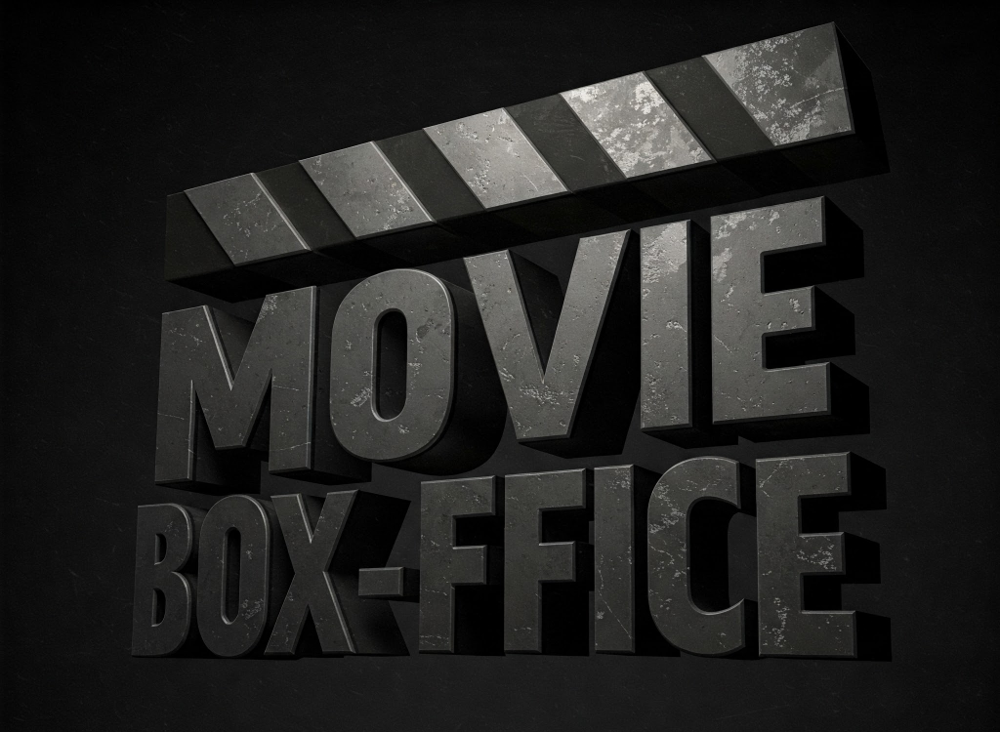
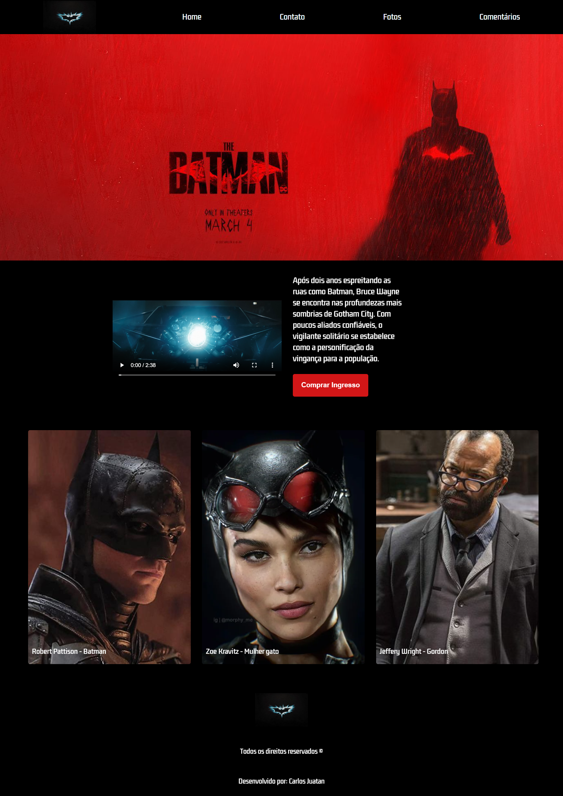

# Movie-Box_Office - Movie Ticket Sales Landing Page (The Batman Film)


## Project Description

Movie-Box_Office is a study project focused on creating a landing page for movie ticket sales (in this case, for The Batman film). The main objective is to practice building an attractive and informative web page designed to encourage users to purchase tickets for the movie. The project features different sections organized across separate pages, including a catchy banner, a movie introduction with a trailer, and an area highlighting the main actors.

## Visual Showcase


_(Overview of the landing page for ticket sales for The Batman movie.)_

## Technologies Used

* HTML5
* CSS3

## Services Used

* **GitHub:** Used for code versioning, collaboration, and hosting the project repository.
* **Live Server (VS Code Extension):** Used to serve the static website locally during development, providing a quick way to preview changes without the need for a full-fledged server.

## How to Run the Project

To view this project locally, follow these steps:

1.  **Clone the repository:**
    ```bash
    git clone https://github.com/Carlos-Juatan/Movie-Box_Office
    ```

2.  **Navigate to the project folder:**
    ```bash
    cd Movie-Box_Office
    ```

3.  **Open the `index.html` file** in VS Code.
4.  **Right-click on the `index.html` file** within VS Code.
5.  **Select the "Open with Live Server" option.**

This will open the Movie-Box_Office landing page in your browser, and Live Server will automatically reload the page whenever you save changes to your HTML or CSS files.

## Main Features

* **Catchy Banner:** A prominent visual section to attract visitor attention and present key information about the movie.
* **Movie Introduction:** An area with a brief description or introduction to The Batman film.
* **Trailer:** Embedding a movie trailer to pique user interest.
* **Main Cast:** Highlighting the principal actors starring in the movie.
* **Separate Pages:** The website content is organized into different pages for better navigation and focus on each section.

## Author

This "Movie-Box_Office" project was developed by Carlos Juatan as an educational project.

You can find more of my projects and contributions on my GitHub profile: https://github.com/Carlos-Juatan/

Feel free to explore the code and reach out if you have any questions or suggestions!

## License

This project is licensed under the MIT License. See the [MIT-License](https://github.com/Carlos-Juatan/Movie-Box_Office/blob/main/LICENSE) file for more information regarding the terms and conditions under which this software is licensed.